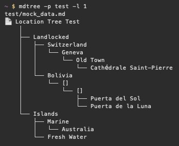

# mdtree
A simple `tree`-like table-of-contents generator for Markdown documents.

## About
I write a lot of Markdown and I often need high-level views of document contents. This program provides hierarchical views of Markdown headers within a document using [box drawing](https://en.wikipedia.org/wiki/Box_Drawing) components for visual flair. Its like `tree`, but for Markdown headers. The program works on files and directories, recursively looking for Markdown docs from the specified path.

My website is written with [Astro frontmatter](https://docs.astro.build/en/guides/markdown-content/) so the program will display `title` values if they exist for the document. If no `title` values exist the program prints the name of the document.

## Install 
Installation is dirt simple if you have Rust (or more specifically Cargo) installed. Clone the repo, navigate to the directory, and run `cargo install --path .` to build/install the binary. See the [cargo-install](https://doc.rust-lang.org/cargo/commands/cargo-install.html) docs for more details about installing from source code.

## Use
You can use the `-h` / `--help` option to see a list of arguments with descriptions. Since there are only two right now its easy to just list them here:
- `-p` / `--path`: Relative path to a file or directory from the current working directory
- `-l` / `--level`: Exclude headings at and above the specified level; E.g. `-l 1` skips H1s, `-l 2` skips H1s and H2s

